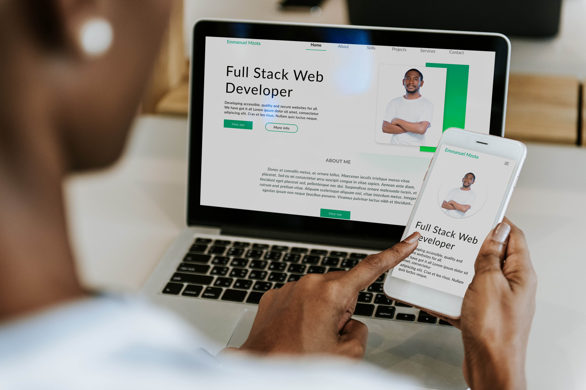

# Mzota Portfolio

  

Having studied web development for over 2 years I have acquired a myriad of skills in designing, programming and animations. My experience in developing robust web applications is second to none for an aspiring software engineer. 

## Top Skills

1. React JS
2. MongoDB
3. Javascript
4. HTML
5. CSS

## Top Projects

1. [Learners corner](https://learners-corner.onrender.com/learners-corner)
2. [Portfolio](https://mzota-portfolio.onrender.com/)
3. [Bank Page](https://mzota2.github.io/BankPage/)
4. [Chat App](https://mzota2.github.io/ChatApp/)

## How to find me?

- [Instagram](https://www.instagram.com/mzotacodes/)
- [Whatsapp]( https://wa.me/265889785341)
- [Twitter](https://twitter.com/EmmanuelChiram8)
- [Email](mailto:mzchirambo@gmail.com)

